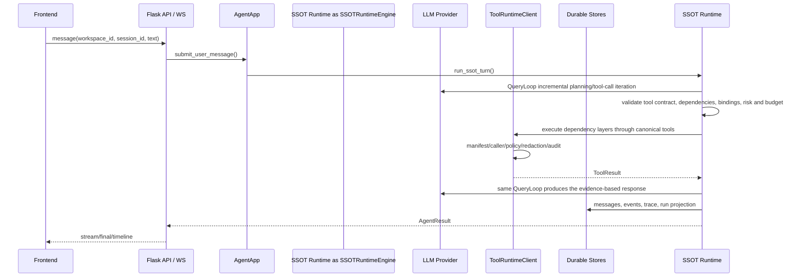

# LZCore Design

本设计文档只描述当前实现，不保留历史架构、历史工具名或旁路实现。

## 设计原则

1. **单主链**：所有用户请求进入同一条运行时链路，避免旁路执行。
2. **硬边界**：工具必须经过 manifest、caller、risk、approval、redaction、audit。
3. **显式 workspace**：所有跨数据边界操作必须带已验证 `workspace_id`。
4. **能力只描述，工具才执行**：业务能力目录用于提示和 UI，不参与 handler 注册。
5. **当前口径优先**：不为已移除 API、历史工具名、过期文档叙述保留分支。
6. **持久化事实清晰**：run、message、artifact、memory 各自由其 canonical store 原子写入，不再复制到第二套事件存储。
7. **Function Calling**：工具 schema 通过 LLM 的 `tools` 参数传递，不文本 dump 到 prompt。

## 主链路



## Durable Runtime

运行时状态由四类数据构成：

- `TaskState`：一次用户任务的权威状态。
- `RuntimeStep`：context、model、tool、final 等阶段步骤。
- `RuntimeEvent`：前端时间线和审计事件来源。
- `RuntimeCheckpoint`：中断、审批、失败恢复的快照。

SSOT Runtime 主链将执行结果投影为 `AgentResult`、message、run 和 trace；长任务类能力仍使用 durable task/checkpoint API 管理自己的可取消状态。

## Tool Runtime

`ToolRuntimeClient.invoke()` 是唯一合法入口。执行顺序：

```text
canonical tool id
  -> CapabilityManifest
  -> requested_by caller gate
  -> ToolPolicy
  -> approval/interrupt when needed
  -> ToolExecutor
  -> redaction
  -> trace/audit
  -> ToolResult
```

当前有 16 个 canonical tool。`handler_id` 是内部实现细节，不暴露给 LLM、前端或公共 API。SSOT Runtime 节点不会直接调用 handler，只能通过 `ToolRuntimeClient.invoke()` 进入工具边界。

## 动态工具编排

QueryLoop 不要求模型预先猜测完整工作流。模型可发起普通单工具调用，也可为一小组调用声明稳定步骤标识、依赖和安全结果绑定；每组执行完成后，模型根据真实证据继续、改路或结束。运行时把每组调用校验为增量任务图：独立只读节点在并发上限内执行，有副作用的节点形成顺序屏障，依赖失败会阻止下游执行。

跨工具结果只允许绑定到声明过的分析输入，不能绕过写入、命令或审批参数的风险检查。`exec.run` 的 Python 动作用 `input_data` 接收结构化证据，并通过 `result` 返回 JSON 可序列化结果。固定工作流与对话编排共享相同的依赖层语义；固定流程用于复用已验证经验，不作为限制对话模型的默认路径。

工具可以在 canonical 定义中声明批处理契约。QueryLoop 只会把同一资源、连续范围、无依赖和无结果绑定的独立标量调用编译为对应批量动作；不连续范围和任务图节点保持原样。批量优化属于运行时通用能力，不在提示词里为某个工具写固定流程。

## 证据总线

工具通过统一的 `evidence_parts` 输出文本、图片、文件或结构化证据。每个证据包含类型、强类型引用、消费方、来源调用和覆盖范围；二进制内容不进入消息历史、运行记录或 trace。QueryLoop 是证据账本的唯一所有者，负责校验、去重、登记、把待消费证据交给下一次模型调用，并在模型适配器确认实际交付后标记为已交付。

原始上传图片和工具派生图片走同一条证据链：原图只在需要的首轮交付一次，工具派生图片在产生后的下一轮交付，不再由 `planner`、`continuation` 等阶段名决定。模型适配器只在单次请求边界把托管文件引用解析成多模态内容。工具参数中的托管文件编号和工作区路径由 canonical 执行契约区分，类型不匹配会在执行前返回可修正的结构化错误。

运行结果使用 `complete`、`partial`、`failed` 描述工具执行完整性；有成功也有失败的运行不得投影成完整成功。最终答复质量门会核对已交付证据，禁止回答与运行时事实相矛盾，例如已经向模型交付图片后仍声称图片不可见。

## Capability Catalog

`agent/capabilities/catalog.py` 是业务能力目录，当前 13 个能力，全部 enabled。目录只提供：

- 能力说明
- 推荐 canonical tool
- prompt hint
- safety note
- 前端展示数据

它不注册工具、不控制权限、不分发 handler。

## Approval

审批只用于高危或破坏性操作。普通 read/list/query 不应因为工具类别本身被阻断。审批生命周期是 durable interrupt：

```text
tool policy requires approval
  -> preallocate final approval ids
  -> persist encrypted exact-call continuation bound to final ids
  -> atomically persist the complete pending-approval batch, then publish it
  -> return immediately without occupying a runtime/HTTP worker
  -> user approve/reject
  -> atomically claim once
  -> re-enter QueryLoop and revalidate schema, policy, risk and approved call keys
  -> canonical ToolRuntime execution + final response, or fail closed
```

普通 Agent continuation 只接受由服务端从加密持久记录构造的类型化授权对象；HTTP/WS
metadata 中的同名 JSON 不能形成授权。多个审批全部通过后才能抢占执行，重复 resolve 不会
重复执行；进程若在执行抢占后异常退出，状态保持 `running` 并禁止自动重放破坏性操作。
待审批轮只持久化用户消息，恢复成功后只补最终助手消息，避免把“等待审批”写成对话结论。

审批创建不存在 placeholder 绑定窗口：整批审批持久化失败时 continuation 会补偿删除，
审批只有在 durable batch 成功后才进入内存和 SSE。执行抢占后记录 `dispatching` 与 heartbeat；
失联记录转为 `stalled` 供管理员核对，但不自动重放结果未知的工具调用。管理员只能显式关闭
已核对的 stalled 记录，恢复执行必须由新的用户任务重新经过 QueryLoop、风险和审批边界。

## Memory Governance

记忆写入必须经过 `MemoryWriteGate`：

1. 校验 workspace。
2. 先检测密钥模式，再脱敏。
3. 根据来源、置信度、scope、TTL、冲突判断状态。
4. 只有 `active`、未过期、同 workspace 的记录可检索。

LLM 失败时不能泄露异常文本，降级原因必须结构化。

## Prompt 与上下文

生产提示词只有一个事实来源：`core/runtime_engine/prompt_contract.py`。它将每轮必需的
Kernel invariants 与按明确上下文追加的 capability playbook 分开；playbook 只提供选择与
验收建议，不隐藏工具、不扩权，也不预先决定工作流。QueryLoop 的执行契约、最终答复
契约、子 Agent system 约束和上下文分隔格式仍属于同一主链。

每轮输入明确分为 runtime identity、`data_only` conversation history、
`data_only` governed context、类型化 trusted runtime item 和 current user request。
外部 HTTP/WS metadata 只允许托管附件引用；不能注入 runtime guidance、历史块、
subagent profile、迭代预算或回调。只有服务端白名单构造器可以生成
`TrustedPromptItem`。历史、记忆、知识、制品和工具输出只能作为证据，不能覆盖
system 规则。子 Agent 的角色、工具范围和预算进入 system prompt，委派目标仍保持为纯用户任务。

工具 schema 通过模型 tools 字段提供；system prompt 只提供策略和工具选择原则，不内联长工具清单。
所有 canonical 工具仍对主管线 LLM 可见，不使用关键词规则裁剪模型能力。

所有 provider 调用统一经过 `agent/llm/prompt_guard.py`：输入注入信号和 request policy
进入 response metadata/trace，隐藏 reasoning 被清理，确定性的密钥与本机路径在展示前
脱敏。QueryLoop 的最终答复质量门再结合真实工具结果检查无证据的动作完成声明，避免
把 planner/continuation 的中间文本误当最终结论拦截。

## Frontend

前端以任务工作台为中心：

- 对话视图展示用户消息、LLM 回复、工具卡、审批气泡。
- 时间线视图读取 `AgentResult.events` 和 runtime state。
- 会话、最近运行、workspace 全部显式绑定。
- 前端不得制造默认 workspace，也不得自行补已移除的 API 格式。
- 所有 SSE 入口统一使用认证流客户端：登录态使用 HttpOnly Cookie，API Token 模式使用
  Fetch streaming 的 `Authorization` header；平台凭据不得进入 URL 查询参数。
