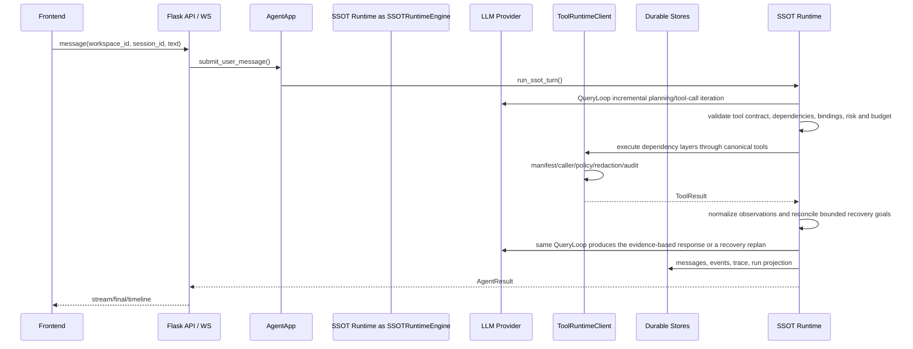

# LZCore Design

本设计文档只描述当前实现，不保留历史架构、历史工具名或旁路实现。

## 设计原则

1. **单主链**：所有用户请求进入同一条运行时链路，避免旁路执行。
2. **硬边界**：工具必须经过 manifest、caller、risk、authorization、redaction、audit。
3. **显式 workspace**：所有跨数据边界操作必须带已验证 `workspace_id`。
4. **能力只描述，工具才执行**：业务能力目录用于提示和 UI，不参与 handler 注册。
5. **当前口径优先**：不为已移除 API、历史工具名、过期文档叙述保留分支。
6. **持久化事实清晰**：run、message、artifact、memory 各自由其 canonical store 原子写入，不再复制到第二套事件存储。
7. **Function Calling**：工具 schema 通过 LLM 的 `tools` 参数传递，不文本 dump 到 prompt。

## 主链路



## Durable Runtime

运行时状态由四类数据构成：

- `TaskState`：一次用户任务的权威状态。
- `RuntimeStep`：context、model、tool、final 等阶段步骤。
- `RuntimeEvent`：前端时间线和审计事件来源。
- `RuntimeCheckpoint`：取消、中断和失败恢复的快照。

`TaskState` 同时保存服务端生成、经过长度限制的未完成恢复目标。后续回合只能从该可信合同恢复目标和断言；浏览器、历史消息或工具输出都不能伪造、扩展或解除目标。

SSOT Runtime 主链将执行结果投影为 `AgentResult`、message、run 和 trace；长任务类能力仍使用 durable task/checkpoint API 管理自己的可取消状态。

## Tool Runtime

`ToolRuntimeClient.invoke()` 是唯一合法入口。执行顺序：

```text
canonical tool id
  -> CapabilityManifest
  -> requested_by caller gate
  -> ToolPolicy
  -> product authorization and hard policy checks
  -> ToolExecutor
  -> redaction
  -> trace/audit
  -> ToolResult
```

当前有 17 个 canonical tool。`handler_id` 是内部实现细节，不暴露给 LLM、前端或公共 API。SSOT Runtime 节点不会直接调用 handler，只能通过 `ToolRuntimeClient.invoke()` 进入工具边界。

`location.manage` 是共享的地理实体解析边界：把地点名称、地址或坐标解析成带提供方证据、行政层级、候选集合和置信度的标准实体，并显式拒绝未消除的歧义。天气、资产、事件、时区和区域分析等能力只能复用这一边界，不得维护各自的城市、省份或经纬度白名单。“长三角”等政策或业务区域仍须依据明确来源或用户口径展开，不能降格为地理编码别名。

## 动态工具编排

QueryLoop 不要求模型预先猜测完整工作流。模型可发起普通单工具调用，也可为一小组调用声明稳定步骤标识、依赖和安全结果绑定；每组执行完成后，模型根据真实证据继续、改路或结束。运行时把每组调用校验为增量任务图：独立只读节点在并发上限内执行，有副作用的节点形成顺序屏障，依赖失败会阻止下游执行。

跨工具结果只允许绑定到声明过的分析输入，不能绕过写入、命令或产品授权边界。`exec.run` 的 Python 动作用 `input_data` 接收结构化证据，并通过 `result` 返回 JSON 可序列化结果。固定工作流与对话编排共享相同的依赖层语义；固定流程用于复用已验证经验，不作为限制对话模型的默认路径。

工具可以在 canonical 定义中声明批处理契约。QueryLoop 可把同一资源的连续范围，或同一动作下不同标量参数的连续集合，编译为有上限的批量动作；有依赖、结果绑定或不连续的任务图节点保持原样。每轮模型计划还受独立节点上限和整轮剩余预算约束，超限计划在任何 handler 执行前退回模型重新分区，不生成虚假的失败调用。子 Agent 的 `max_steps` 约束推理轮次，`max_tool_nodes` 独立约束累计执行节点，不能通过单轮大批量绕过节点预算。批量优化属于运行时通用能力，不在提示词里为某个工具写固定流程。

### 目标驱动恢复循环

每轮 canonical 工具结果先成为标准化观察。可恢复的只读失败在没有领域恢复指令时创建通用 `tool_recovery` 目标；领域扩展可发布 `runtime_recoveries` 列表创建更具体的证据目标。目标带来源调用、工具、动作、有限的资源标识、失败类别、候选策略和尝试上限，运行时断言在目标未关闭时阻止模型提前给出最终答复。

模型必须采用实质不同的安全策略：修正 schema 参数、缩小观察范围、调用其他已注册只读能力，或先查权威资料再做新的实时观察。跨工具调用需通过 `plan_goal_ids` 明确关联相应目标；共享 workspace、设备或连接标识不构成证据关联。三次已关联的失败替代后目标变为 `blocked`，而不是无限重放。写入、权限/策略拒绝、取消和写入结果未知不属于自动恢复入口。

成功的只读观察会满足已关联目标；有副作用的成功调用不得满足读取目标。网络扩展的命令意图恢复只是这一合同的一个实现：驱动层 collect 和权威文档可帮助模型纠正后续读取，但文档本身不能声明设备实时状态。完整字段和测试要求见 [Loop Engineering](docs/LOOP_ENGINEERING.md)。

## 证据总线

工具通过统一的 `evidence_parts` 输出文本、图片、文件或结构化证据。每个证据包含类型、强类型引用、消费方、来源调用和覆盖范围；二进制内容不进入消息历史、运行记录或 trace。QueryLoop 是证据账本的唯一所有者，负责校验、去重、登记、把待消费证据交给下一次模型调用，并在模型适配器确认实际交付后标记为已交付。

原始上传图片和工具派生图片走同一条证据链：原图只在需要的首轮交付一次，工具派生图片在产生后的下一轮交付，不再由 `planner`、`continuation` 等阶段名决定。模型适配器只在单次请求边界把托管文件引用解析成多模态内容。工具参数中的托管文件编号和工作区路径由 canonical 执行契约区分，类型不匹配会在执行前返回可修正的结构化错误。

运行结果用两个正交字段描述：`execution_outcome` 表示用户任务是否完成，`tool_execution_outcome` 表示工具尝试是否全部成功。工具调用有失败并不自动意味着任务只完成了一部分；只要模型通过其他真实证据完成了用户目标，任务仍可为 `complete`，但失败尝试必须保留在动作跟踪中。恢复目标耗尽且仍保留部分已验证覆盖时，任务为 `partial`；外部写入结果未知始终为 `unknown`，不得伪装为失败后重试或完成。最终答复只经过确定性的完整性守卫，核对运行时可机械证明的矛盾（例如已经向模型交付图片后仍声称图片不可见）、敏感信息、伪造引用和服务器生成的续写合同。语言风格、领域术语、表格布局、业务正确性和语义覆盖由提示词、工具证据契约与模型判断负责，不在本地维护领域正则评分器。

## Capability Catalog

`agent/capabilities/catalog.py` 是业务能力目录；当前数量由目录动态计算，不在文档中固定。目录只提供：

- 能力说明
- 推荐 canonical tool
- prompt hint
- safety note
- 前端展示数据

它不注册工具、不控制权限、不分发 handler。

## Product authorization

运行时不包含交互式审批子系统。产品动作由其所有者执行服务核定权限；网络设备写入以工作台选择的已发布 Skill 为唯一授权来源，必须同时满足 `configuration_write`、目标连接范围和允许工具范围。未授权调用直接返回结构化错误，不进入等待、续跑或后台重放状态。

主机级破坏性命令由通用策略直接阻断。外部写入若返回结果未知，操作账本保留事实并要求 read-back/reconcile；系统不得因重试、恢复或进程重启自动重放非幂等写入。

## Memory Governance

记忆写入必须经过 `MemoryWriteGate`：

1. 校验 workspace。
2. 先检测密钥模式，再脱敏。
3. 根据来源、置信度、scope、TTL、冲突判断状态。
4. 只有 `active`、未过期、同 workspace 的记录可检索。

LLM 失败时不能泄露异常文本，降级原因必须结构化。

## Prompt 与上下文

生产提示词只有一个事实来源：`core/runtime_engine/prompt_contract.py`。它将每轮必需的
Kernel invariants 与按明确上下文追加的 capability playbook 分开；playbook 只提供选择与
验收建议，不隐藏工具、不扩权，也不预先决定工作流。QueryLoop 的执行契约、最终答复
契约、子 Agent system 约束和上下文分隔格式仍属于同一主链。

每轮输入明确分为 runtime identity、`data_only` conversation history、
`data_only` governed context、类型化 trusted runtime item 和 current user request。
外部 HTTP/WS metadata 只允许托管附件引用；不能注入 runtime guidance、历史块、
subagent profile、迭代预算或回调。只有服务端白名单构造器可以生成
`TrustedPromptItem`。历史、记忆、知识、制品和工具输出只能作为证据，不能覆盖
system 规则。子 Agent 的角色、工具范围和预算进入 system prompt，委派目标仍保持为纯用户任务。

工具 schema 通过模型 tools 字段提供；system prompt 只提供策略和工具选择原则，不内联长工具清单。
所有 canonical 工具仍对主管线 LLM 可见，不使用关键词规则裁剪模型能力。

所有 provider 调用统一经过 `agent/llm/prompt_guard.py`：输入注入信号和 request policy
进入 response metadata/trace，隐藏 reasoning 被清理，确定性的密钥与本机路径在展示前
脱敏。QueryLoop 的最终答复完整性守卫只结合真实工具结果检查无证据的动作完成声明、
敏感输出、伪造引用和中间过渡文本；领域质量、语言与排版由统一提示词和证据契约负责。

## Frontend

前端以任务工作台为中心：

- 对话视图展示用户消息、LLM 回复和工具卡。
- 时间线视图读取 `AgentResult.events` 和 runtime state。
- 会话、最近运行、workspace 全部显式绑定。
- 前端不得制造默认 workspace，也不得自行补已移除的 API 格式。
- 所有 SSE 入口统一使用认证流客户端：登录态使用 HttpOnly Cookie，API Token 模式使用
  Fetch streaming 的 `Authorization` header；平台凭据不得进入 URL 查询参数。
